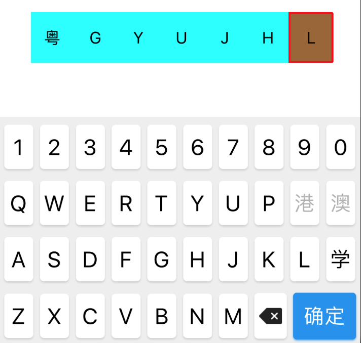

# 停车王车牌号码专用键盘 VehicleKeyboard - iOS

`VehicleKeyboard`是停车王品牌的各端产品线的基础组件，专为提高中国车牌号码输入速度而定制开发的专用键盘组件，包括以下三个项目：

- `VehicleKeyboard-Android` Android项目，为Android客户端定制包括输入组件、键盘组件及相关控制逻辑实现；
- `VehicleKeyboard-iOS` iOS客户端项目，为iOS客户端定制包括输入组件、键盘组件及相关控制逻辑实现；
- `VehicleKeyboard-JS` JavaScript项目，为H5页面定制，包括Web、微信、支付宝等，同样包括输入组件、键盘组件及相关控制逻辑实现

- VehicleKeyboard-Android GitHub项目主页： [https://github.com/parkingwang/vehicle-keyboard-android](https://github.com/parkingwang/vehicle-keyboard-android)
- VehicleKeyboard-Android OSChina项目主页： [https://gitee.com/iRainIoT/vehicle-keyboard-android](https://gitee.com/iRainIoT/vehicle-keyboard-android)

- VehicleKeyboard-iOS [准备中]GitHub项目主页： [https://github.com/parkingwang/vehicle-keyboard-iOS](https://github.com/parkingwang/vehicle-keyboard-ios)
- VehicleKeyboard-iOS [准备中]OSChina项目主页： [https://gitee.com/iRainIoT/vehicle-keyboard-iOS](https://gitee.com/iRainIoT/vehicle-keyboard-ios)

- VehicleKeyboard-JS GitHub项目主页： [https://github.com/parkingwang/vehicle-keyboard-js](https://github.com/parkingwang/vehicle-keyboard-js)
- VehicleKeyboard-JS OSChina项目主页： [https://gitee.com/iRainIoT/vehicle-keyboard-js](https://gitee.com/iRainIoT/vehicle-keyboard-js)

## 概述

#### 键盘作为inputView使用

* 可直接赋给textField或textView，使用方式和常规键盘一致
* 提供包含自定义输入框的使用方式，逻辑已实现，使用者需自行修改样式

#### 已适配横竖屏、iPhone X


## 使用组件

### 直接作为inputView使用


```
#import "PWPlateKeyBoardWindow.h"

__weak typeof (self)weakSelf = self;
self.textField.inputView = [PWPlateKeyBoardWindow shareInstance];
[PWPlateKeyBoardWindow shareInstance].buttonClickBlock = ^(PWPlteKeyBoardButtonType buttonType, NSString *text) {
    switch (buttonType) {
        //当键位类型为确定时，收回键盘
        case PWPlteKeyBoardButtonTypeDone:
            [weakSelf.textField resignFirstResponder];
            break;
        default:
            //改变textField的text
            [weakSelf.textField changetext:text];
            //将对应的改动传递给js，使键盘的刷新获取对应的键位
            [[PWPlateKeyBoardWindow shareInstance] setPlate:weakSelf.textField.text type:[PWPlateKeyBoardWindow shareInstance].type index:[weakSelf.textField offsetFromPosition:weakSelf.textField.beginningOfDocument toPosition:weakSelf.textField.selectedTextRange.start]];
            break;
    }
};
```

### 自定义输入框



```
#import "PWHandler.h"

//实例化PWHandler，同时注册UICollectionViewCell，此cell需要继承PWSegmentCollectionViewCell，供使用者自定义样式
self.handler = [[PWHandler alloc] initWithReuseIdentifier:NSStringFromClass(TestCollectionViewCell.class)];

//设置PWHandler中UICollectionView的应用，在PWHandler实现中用于UICollectionView的相关操作
self.handler.collectionView = self.collectionView;

//PWHandler中(NSString *)plate提供车牌号的主动设置，可也用此属性过去当前的车牌号
//self.handler.plate = @"京A23456";

//使用者自己提供的UICollectionView，仅需注册UICollectionViewCell，同时将代理引用与PWHandler关联
[self.collectionView registerClass:TestCollectionViewCell.class forCellWithReuseIdentifier:NSStringFromClass(TestCollectionViewCell.class)];
self.collectionView.delegate = self.handler;
self.collectionView.dataSource = self.handler;
self.collectionView.clipsToBounds = NO;

```

## 主要类的介绍

> 详细属性介绍请看注释

* PWKeyboardView:核心类，主要实现键盘逻辑与布局;
* PWHandler:自定义输入框的核心类，主要实现输入框逻辑，若使用者希望更好的调整布局，可继承此类重写layout的代理方法;
* PWSegmentCollectionViewCell:自定义输入框cell，使用者可通过继承该类，对cell样式及各状态效果进行调整;


## 注意

* 直接作为inputView使用时，当输入长度超过车牌规定长度时，键盘会自动收起
* 键盘除了主题色外，其他样式暂不支持修改

## cocoaPods

> 会自动引入JSONModel

```
pod 'PWKeyboard'
```

## 维护

- [陈永佳](https://github.com/yoojia) 联系方式：chenyongjia@parkingwang.com
- [f2yu](https://github.com/f2yu) 联系方式：fengziyu@parkingwang.com

## License

    Copyright 2017 Xi'an iRain IOT Technology service CO., Ltd (ShenZhen)

    Licensed under the Apache License, Version 2.0 (the "License");
    you may not use this file except in compliance with the License.
    You may obtain a copy of the License at

    http://www.apache.org/licenses/LICENSE-2.0

    Unless required by applicable law or agreed to in writing, software
    distributed under the License is distributed on an "AS IS" BASIS,
    WITHOUT WARRANTIES OR CONDITIONS OF ANY KIND, either express or implied.
    See the License for the specific language governing permissions and
    limitations under the License.