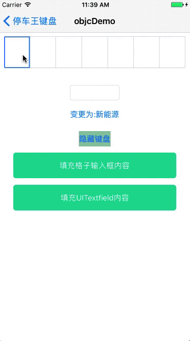
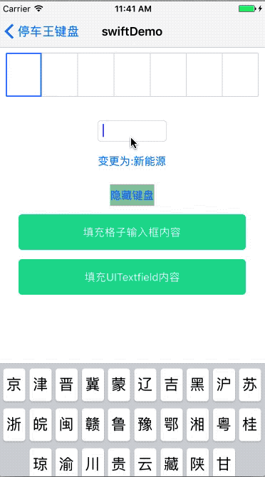

# 停车王车牌号码专用键盘 VehicleKeyboard - iOS

## 概述

* 停车王车牌号码专用键盘ios版，支持新能源、武警、领事馆等多项专用格式车牌。
* 代码为swift编写，已支持oc调用，可以绑定collectionView使用格子输入或绑定UItextfield输入，键盘与系统键盘用法类似。





## 如何使用

### 使用cocoaPods导入

在podfile中添加

```
pod 'VehicleKeyboard-swift',
```
然后pod install一下

## OC调用

oc引用pod中的库

```objective-c
#import "VehicleKeyboard_swift-Swift.h"
```

### 直接作为inputView使用

```objective-c
[self.myTextField changeToPlatePWKeyBoardInpurView];
```
直接作为inputView使用时，回调于取值都与系统方法一直，直接当做系统UItextfiel使用即可

### 格子式车牌专用输入框调用

首先在需要显示的位置摆放一个刚实例化的collectionView，
然后创建一个PWHandler对象将collectionView于格子车牌输入框进行绑定

```objective-c

@property (strong,nonatomic) PWHandler *handler;

self.handler = [PWHandler new];
[self.handler setKeyBoardViewWithCollectionView:self.collectionView];

self.handler.delegate = self;
//改变主题色
self.handler.mainColor = [UIColor redColor];
//改变文字大小
self.handler.textFontSize = 18;
//改变文字颜色
self.handler.textColor = [UIColor greenColor];
```

格子输入框的各种回调方法
```objective-c
//输入完成点击确定后的回调
- (void)palteDidChnageWithPlate:(NSString *)plate complete:(BOOL)complete{
NSLog(@"输入车牌号为:%@ \n 是否完整：%@",plate,complete ? @"完整" : @"不完整");
}

//车牌输入发生变化时的回调
- (void)plateInputCompleteWithPlate:(NSString *)plate{
NSLog(@"输入完成。车牌号为:%@",plate);
}

//车牌键盘出现的回调
- (void)plateKeyBoardShow{
NSLog(@"键盘显示了");
}

//车牌键盘消失的回调
- (void) plateKeyBoardHidden{
NSLog(@"键盘隐藏了");
}
```


## Swift调用

引用pod中的库

```swift
import VehicleKeyboard_swift
```

### 直接作为inputView使用

```swift
myTextField.changeToPlatePWKeyBoardInpurView()
```
直接作为inputView使用时，回调于取值都与系统方法一直，直接当做系统UItextfiel使用即可

### 格子式车牌专用输入框调用

首先在需要显示的位置摆放一个刚实例化的collectionView，
然后创建一个PWHandler对象将collectionView于格子车牌输入框进行绑定

```swift

let handler = PWHandler()

handler.delegate = self
handler.setKeyBoardView(collectionView: collectionView)
//改变主题色
handler.mainColor = UIColor.red
//改变字体大小
handler.textFontSize = 18
//改变字体颜色
handler.textColor = UIColor.blue
```

格子输入框的各种回调方法
```swift
//输入完成点击确定后的回调
func plateInputComplete(plate: String) {
print("输入完成车牌号为:" + plate)
}
//车牌输入发生变化时的回调
func palteDidChnage(plate:String,complete:Bool) {
print("输入车牌号为:" + plate + "\n输入是否完整？:" + (complete ? "完整" : "不完整"))
}
//车牌键盘出现的回调
func plateKeyBoardShow() {
print("车牌键盘显示")
}
//车牌键盘消失的回调
func plateKeyBoardHidden() {
print("车牌键盘隐藏")
}
```

## 主要类的介绍

> 详细属性介绍请看注释

* PWKeyboardView:核心类，主要实现键盘逻辑与布局;
* PWHandler:自定义输入框的核心类，主要实现输入框逻辑，若使用者希望更好的调整布局，可继承此类重写layout的代理方法;


## 注意

* 直接作为inputView使用时，当输入长度超过车牌规定长度时，会默认更新最后一位输入内容
* 键盘除了主题色外，其他样式暂不支持修改


## 支持
`VehicleKeyboard`是停车王品牌的各端产品线的基础组件，专为提高中国车牌号码输入速度而定制开发的专用键盘组件，包括以下三个项目：

- `VehicleKeyboard-Android` Android项目，为Android客户端定制包括输入组件、键盘组件及相关控制逻辑实现；
- `VehicleKeyboard-iOS` iOS客户端项目，为iOS客户端定制包括输入组件、键盘组件及相关控制逻辑实现；
- `VehicleKeyboard-JS` JavaScript项目，为H5页面定制，包括Web、微信、支付宝等，同样包括输入组件、键盘组件及相关控制逻辑实现

- VehicleKeyboard-Android GitHub项目主页： [https://github.com/parkingwang/vehicle-keyboard-android](https://github.com/parkingwang/vehicle-keyboard-android)
- VehicleKeyboard-Android OSChina项目主页： [https://gitee.com/iRainIoT/vehicle-keyboard-android](https://gitee.com/iRainIoT/vehicle-keyboard-android)

- VehicleKeyboard-iOS [准备中]GitHub项目主页： [https://github.com/parkingwang/vehicle-keyboard-iOS](https://github.com/parkingwang/vehicle-keyboard-ios)
- VehicleKeyboard-iOS [准备中]OSChina项目主页： [https://gitee.com/iRainIoT/vehicle-keyboard-iOS](https://gitee.com/iRainIoT/vehicle-keyboard-ios)

- VehicleKeyboard-JS GitHub项目主页： [https://github.com/parkingwang/vehicle-keyboard-js](https://github.com/parkingwang/vehicle-keyboard-js)
- VehicleKeyboard-JS OSChina项目主页： [https://gitee.com/iRainIoT/vehicle-keyboard-js](https://gitee.com/iRainIoT/vehicle-keyboard-js)


## 维护

- [杨志豪](https://github.com/yzhtracy) 联系方式：yangzhihao@parkingwang.com
- [陈永佳](https://github.com/yoojia) 联系方式：chenyongjia@parkingwang.com

## 疑问与交流

如果你在使用此键盘时，出现一些问题，或者有相关疑问。可以添加以下微信技术群做讨论。


如果群二维码过期，可以通过以下微信加好友，注明“车牌键盘”，我会拉到专门技术群做讨论。


## License

    Copyright 2017 Xi'an iRain IOT Technology service CO., Ltd (ShenZhen)

    Licensed under the Apache License, Version 2.0 (the "License");
    you may not use this file except in compliance with the License.
    You may obtain a copy of the License at

    http://www.apache.org/licenses/LICENSE-2.0

    Unless required by applicable law or agreed to in writing, software
    distributed under the License is distributed on an "AS IS" BASIS,
    WITHOUT WARRANTIES OR CONDITIONS OF ANY KIND, either express or implied.
    See the License for the specific language governing permissions and
    limitations under the License.
